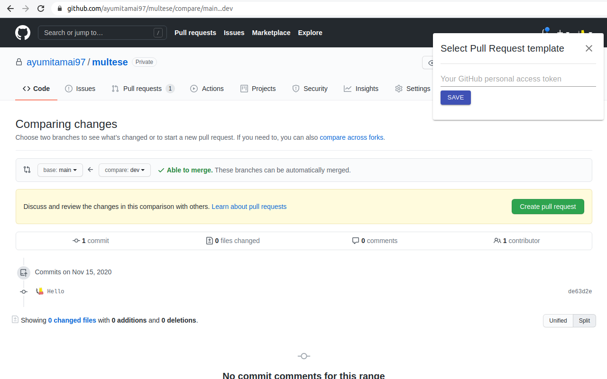
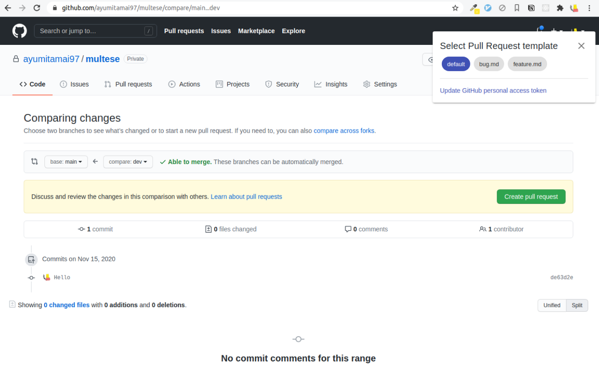

# Multese

Multese brings order to _chaotic Pull Request description_, by letting you utilize **multi**ple Pull Request templates. :dog:

## Usage

1. Install [Multese](https://chrome.google.com/webstore/detail/multese/gbemnmnccbkifpcogeokbldhapeeobag) at Chrome Web Store

2. Place some Pull Request templates in your repository's `.github/PULL_REQUEST_TEMPLATE/` directory as stated in [official docs](https://docs.github.com/en/free-pro-team@latest/github/building-a-strong-community/creating-a-pull-request-template-for-your-repository)

3. Get your GitHub personal access token on https://github.com/settings/tokens/new

    *Scopes should be set to `repo` (Full control of private repositories).

    *Multese use your token **only for GitHub API** and store it only in your chrome storage, so that it can get Pull Request templates from the repository

4. Compare your topic branch with main branch

  URL should look like this: https://github.com/ayumitamai97/multese/compare/main...dev

5. Paste your GitHub personal access token to Multese dialog in the upper-right corner of the page
and click "SAVE"

6. Here it is!

## Troubleshooting

### My Pull Request template does not show up

- Ensure you have registered your valid GitHub personal access token

- Ensure your Pull Request template directory is named correctly (`.github/PULL_REQUEST_TEMPLATE/`)

- If hostname is not `github.com`, Multese may not work

### Other troubles

Contact me, or submit an Issue / Pull Request
